<div align="center">

# ⚡ DevOps Performance Platform
### Production-Style Kubernetes & GitOps Performance Engineering


</div>

<br>

A production-style DevOps and Kubernetes **performance engineering** project demonstrating a full path from commit to canary rollout — containerized FastAPI, GitOps delivery, progressive traffic shifting, autoscaling, and full observability.

> 🧪 **Environment:** Local multi-node Kubernetes cluster using **Minikube.**
> The project is designed using production-style Kubernetes/GitOps patterns, but is intentionally deployed on a local Minikube cluster rather than EKS/AKS/GKE.

<br>

## ✨ What This Project Demonstrates

<table>
<tr>
<td valign="top" width="33%">

**🏗️ Platform**
- Containerized FastAPI app
- PostgreSQL database
- Redis caching
- Kubernetes high availability
- Horizontal Pod Autoscaling
- Immutable image versions
- Zero-downtime deployments

</td>
<td valign="top" width="33%">

**🔄 Delivery**
- Helm-based deployment
- Argo CD GitOps
- Argo Rollouts (canary)
- Istio traffic management
- Blue-green design
- GitHub Actions CI

</td>
<td valign="top" width="33%">

**📊 Observability**
- Prometheus monitoring
- Grafana dashboards
- K6 performance testing
- P95 latency tracking
- CPU-driven autoscaling

</td>
</tr>
</table>

<br>

## 1️⃣ Project Overview

The DevOps Performance Platform is a containerized FastAPI application deployed on a multi-node Kubernetes cluster, combining **CI, GitOps delivery, progressive rollout, service mesh routing, and observability-driven autoscaling.**

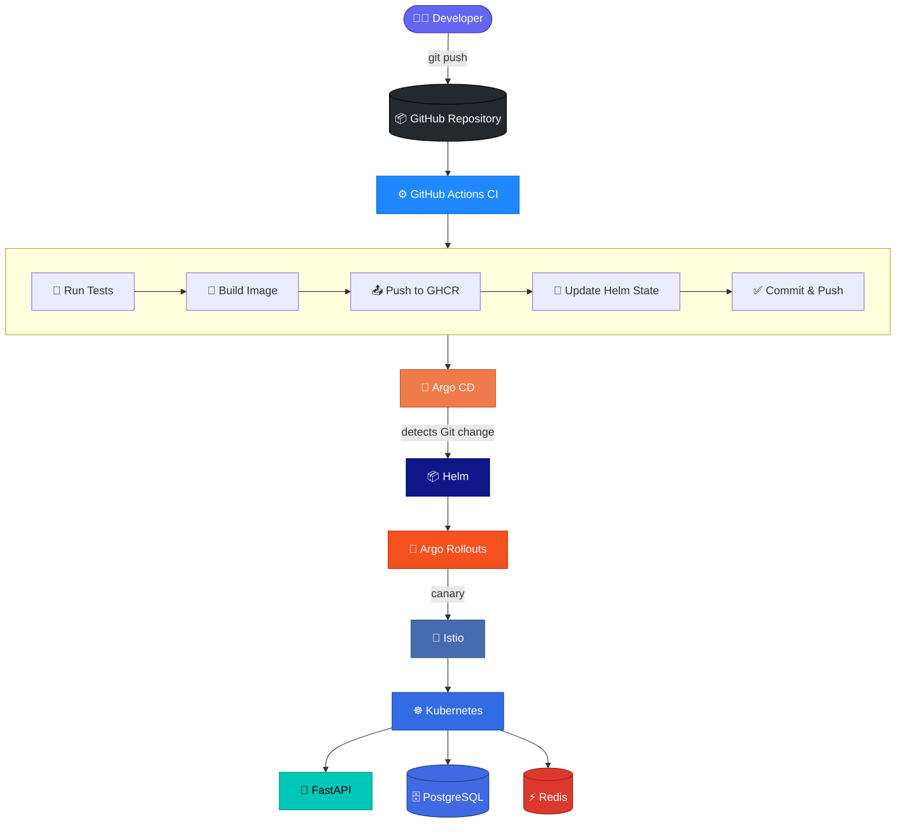

**Observability and scaling operate independently of the delivery pipeline:**

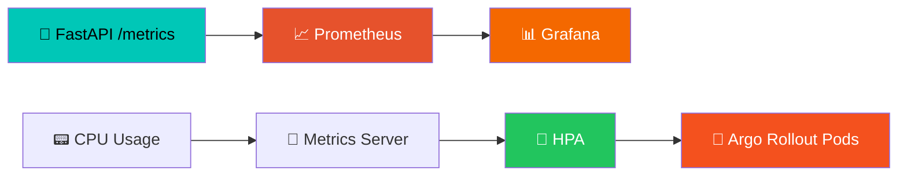

<br>

## 2️⃣ Architecture

### 🧩 Application Architecture

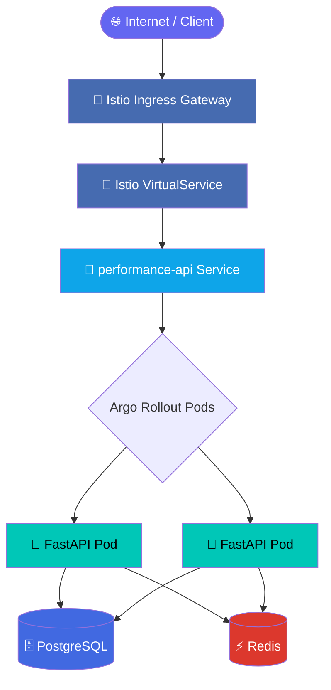

### ⚙️ DevOps Architecture

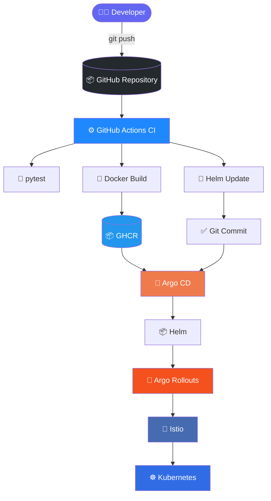

<br>

## 3️⃣ Technology Stack

| Component | Technology |
|---|---|
| 🧩 **Application** | Python / FastAPI |
| 🗄️ **Database** | PostgreSQL |
| ⚡ **Cache** | Redis |
| 🐳 **Containerization** | Docker |
| ☸️ **Orchestration** | Kubernetes |
| 🧪 **Local Cluster** | Minikube |
| 📦 **Package Manager** | Helm |
| ⚙️ **CI** | GitHub Actions |
| 🔄 **CD / GitOps** | Argo CD |
| 🚀 **Progressive Delivery** | Argo Rollouts |
| 🔀 **Traffic Management** | Istio |
| 📈 **Monitoring** | Prometheus |
| 📊 **Visualization** | Grafana |
| 🧪 **Load Testing** | K6 |
| 📦 **Container Registry** | GitHub Container Registry |
| 🌐 **Application Protocol** | HTTP / REST |

<br>

## 4️⃣ Repository Structure

```
.
├── app/
│   ├── Dockerfile
│   ├── pytest.ini
│   ├── requirements.txt
│   ├── src/
│   │   ├── cache.py
│   │   ├── config.py
│   │   ├── database.py
│   │   ├── init_db.py
│   │   ├── main.py
│   │   ├── models.py
│   │   ├── schemas.py
│   │   └── routers/
│   │       └── products.py
│   └── tests/
│       ├── conftest.py
│       ├── test_health.py
│       └── test_products.py
│
├── helm/
│   ├── app/
│   │   ├── Chart.yaml
│   │   ├── values.yaml
│   │   └── templates/
│   │       ├── configmap.yaml
│   │       ├── destination-rule.yaml
│   │       ├── gateway.yaml
│   │       ├── hpa.yaml
│   │       ├── ingress.yaml
│   │       ├── rollout.yaml
│   │       ├── secret.yaml
│   │       ├── service.yaml
│   │       ├── servicemonitor.yaml
│   │       └── virtual-service.yaml
│   │
│   ├── postgresql/
│   │   └── values.yaml
│   │
│   └── redis/
│       └── values.yaml
│
├── load-test/
│   └── api-load.js
│
├── reports/
│   ├── architecture/
│   ├── performance/
│   └── screenshots/
│
├── .github/
│   └── workflows/
│       └── ci.yml
│
├── compose.yaml
└── README.md
```

> ℹ️ Application deployment manifests are managed entirely through the Helm chart under `helm/app/`. The project does not use a second raw Kubernetes manifest deployment path.

<br>

## 5️⃣ Application

Built using **FastAPI**. Main endpoints:

| Method | Endpoint | Purpose |
|---|---|---|
| `GET` | `/health` | Liveness check |
| `GET` | `/ready` | Readiness check |
| `GET` | `/metrics` | Prometheus metrics |
| `GET` | `/api/products` | List products |
| `GET` | `/api/products/{id}` | Get a single product |

```bash
curl http://performance.local/health
# { "status": "healthy" }

curl http://performance.local/ready
# { "status": "ready" }

curl http://performance.local/api/products
```

<br>

## 6️⃣ Docker

The application is containerized using Docker and published to **GitHub Container Registry**:

```
ghcr.io/rithuraj6/devops-perfomance-api
```

🚫 The project intentionally **does not** use `:latest`. Every image is versioned with a CI-generated build identifier, giving full traceability:


<br>

## 7️⃣ Kubernetes

The application runs on a **multi-node Minikube** cluster.

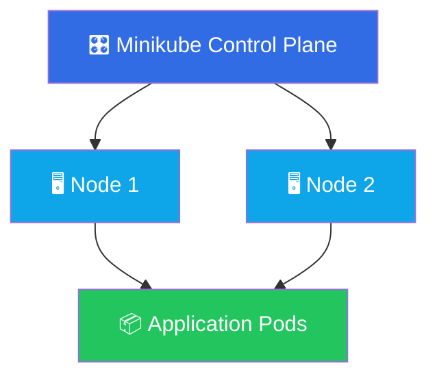

```yaml
replicaCount: 2
```

Pod anti-affinity is used to prefer scheduling replicas on **different nodes**, reducing the impact of losing a single node.

<br>

## 8️⃣ High Availability

The FastAPI application is **stateless** and runs with multiple replicas behind a stable Kubernetes Service.

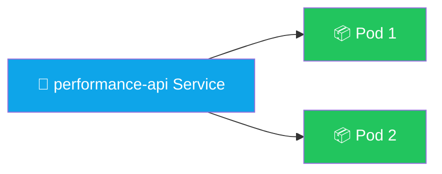

| Probe | Path | Purpose |
|---|---|---|
| 🟢 Readiness | `/ready` | Determines whether a pod can receive traffic |
| ❤️ Liveness | `/health` | Determines whether Kubernetes should restart an unhealthy container |

<br>

## 9️⃣ Horizontal Pod Autoscaling

| Setting | Value |
|---|---|
| Minimum replicas | `2` |
| Maximum replicas | `5` |
| CPU target | `60%` |

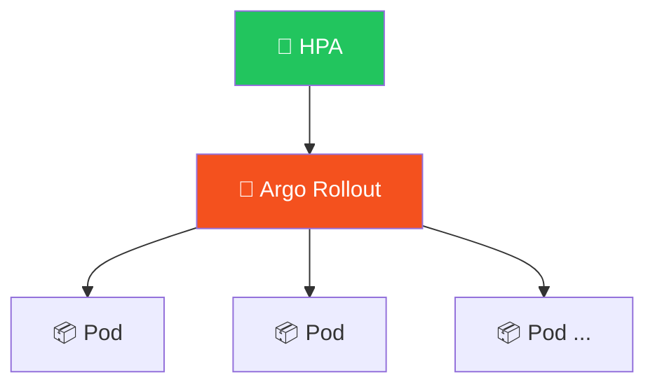

During K6 load testing, CPU utilization increased and HPA scaled the application:

<div align="center">

**2 replicas → 3 replicas** (under load) → back toward minimum after load decreased

</div>

<br>

## 🔟 Helm

Deployment is fully managed via Helm.

```bash
# Validate
helm lint helm/app

# Render
helm template performance-api helm/app
```

The Helm chart manages: `Rollout` · `Service` · `HPA` · `ConfigMap` · `Secret` · `ServiceMonitor` · `Istio Gateway` · `Istio VirtualService` · `Istio DestinationRule`

This keeps the Kubernetes desired state **version-controlled and reproducible.**

<br>

## 1️⃣1️⃣ GitOps with Argo CD

Argo CD handles **Continuous Delivery** — the Git repository is the single source of truth.

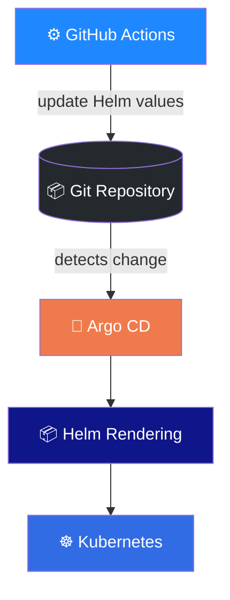

> 🚫 GitHub Actions **never** runs `kubectl apply`, `kubectl set image`, or `kubectl patch` as a deployment step. CI only updates the desired Helm state and pushes to Git — **Argo CD reconciles the cluster.**

<br>

## 1️⃣2️⃣ Continuous Integration

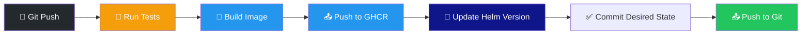

Application tests run with **pytest**, and the pipeline only builds/publishes when appropriate.

<br>

## 1️⃣3️⃣ Dynamic Build Versioning

🚫 **Never hardcode** `image.tag: latest`.


**Example:**

```
Build 42 → ghcr.io/rithuraj6/devops-perfomance-api:42 → Helm values → Argo CD
```

Every deployment is traceable to a specific CI build number.

<br>

## 1️⃣4️⃣ Canary Deployment

Argo Rollouts manages progressive delivery using a **Canary** strategy.


| Stage | Traffic to Canary |
|:---:|:---:|
| 1 | 🟪 10% |
| 2 | 🟪🟪 25% |
| 3 | 🟪🟪🟪🟪🟪 50% |
| 4 | 🟪🟪🟪🟪🟪🟪🟪 75% |
| 5 | 🟪🟪🟪🟪🟪🟪🟪🟪🟪🟪 100% |

Pauses are included between stages so the new version receives **gradually increasing traffic** instead of an immediate 100% cutover.

<br>

## 1️⃣5️⃣ Istio Traffic Management

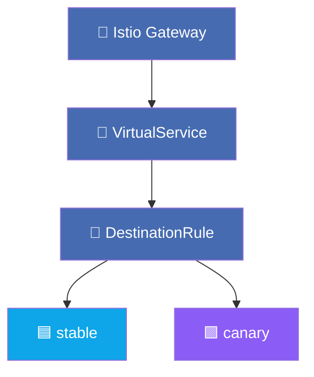

```yaml
route:
  - destination:
      host: performance-api
      subset: stable
    weight: 100

  - destination:
      host: performance-api
      subset: canary
    weight: 0
```

During a canary rollout, these weights are **dynamically adjusted by Argo Rollouts.**

<br>

## 1️⃣6️⃣ Zero-Downtime Deployment

Achieved through the combination of:

✅ Multiple application replicas · ✅ Kubernetes Service · ✅ Readiness probes · ✅ Liveness probes · ✅ Argo Rollouts · ✅ Progressive traffic shifting · ✅ Istio traffic management · ✅ Controlled rollout progression

Traffic is shifted **gradually**, never by replacing all pods simultaneously.

<br>

## 1️⃣7️⃣ Blue-Green Deployment

Included as a supported progressive-delivery design.


`BLUE` = current version · `GREEN` = new version — traffic is switched between them atomically.

> ℹ️ **Canary** remains the primary live deployment strategy for the performance demonstration; Blue-Green is retained as a supported strategy for the project requirement.

<br>

## 1️⃣8️⃣ PostgreSQL

| Setting | Value |
|---|---|
| Database | `performance_db` |
| User | `app_user` |
| Port | `5432` |
| Persistent storage | `10Gi` (PVC) |

Deployed via Helm; data validated after restarting the database workload. Sample data includes products such as **Kubernetes Laptop** and **DevOps Monitor**.

<br>

## 1️⃣9️⃣ Redis

Used as the application caching layer, deployed via Helm with **1Gi** persistence.

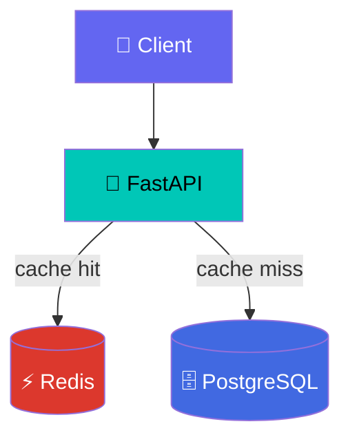

<br>

## 2️⃣0️⃣ Prometheus Monitoring

Metrics exposed at `/metrics`, discovered via a Kubernetes `ServiceMonitor` (`helm/app/templates/servicemonitor.yaml`).

**Key metrics:**
- `http_requests_total`
- `http_request_duration_seconds_bucket`
- `http_request_duration_seconds_count`
- `http_request_duration_seconds_sum`

✅ Prometheus verified to scrape both application pods successfully.

<br>

## 2️⃣1️⃣ Grafana

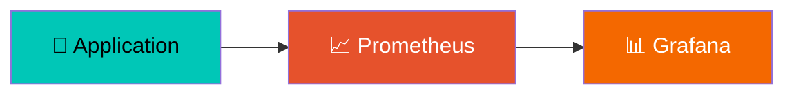

**Dashboard panels:** API request rate · HPA replica count · HPA desired replicas · P95 latency · CPU utilization

<br>

## 2️⃣2️⃣ Performance Testing

K6 load test script: `load-test/api-load.js`

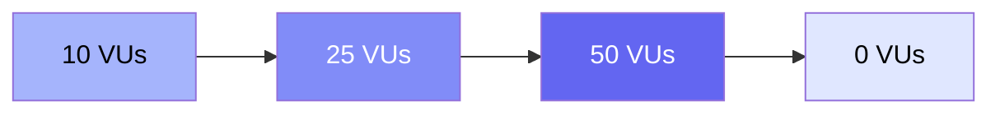

Validates: HTTP success rate · response latency · request throughput · application scalability · HPA behavior

<br>

## 2️⃣3️⃣ Performance Test Results

**Target:** `GET /api/products` · **Duration:** 3 minutes · **Max VUs:** 50

<div align="center">

| Metric | Result |
|---|:---:|
| 📊 Total requests | **4,144** |
| ⚡ Average throughput | **22.96 req/s** |
| ❌ HTTP failures | **0.00%** ✅ |
| ⏱️ P95 latency | **18.43 ms** |
| 👥 Maximum VUs | **50** |
| ✅ Checks passed | **100%** |

</div>


The application successfully handled the load **without any HTTP request failures.**

<br>

## 2️⃣4️⃣ HPA Performance During Load

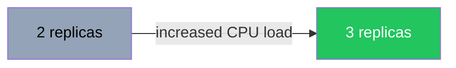

| Setting | Value |
|---|---|
| `minReplicas` | 2 |
| `maxReplicas` | 5 |
| CPU target | 60% |

This confirms the application **automatically scales based on CPU utilization.**

<br>

## 2️⃣5️⃣ Prometheus P95 Latency

```promql
histogram_quantile(
  0.95,
  sum by (le) (
    rate(http_request_duration_seconds_bucket{
      namespace="performance-platform",
      handler="/api/products",
      method="GET"
    }[5m])
  )
)
```

| Source | P95 Latency |
|---|:---:|
| 📈 Prometheus (monitoring window) | ~95 ms |
| 🧪 K6 (end-to-end test run) | 18.43 ms |

> The difference is expected — the measurements come from different observation windows and measurement layers.

<br>

## 2️⃣6️⃣ CPU Monitoring

```promql
sum by (pod) (
  rate(
    container_cpu_usage_seconds_total{
      namespace="performance-platform",
      pod=~"performance-api-.*",
      cpu="total"
    }[5m]
  )
) * 100
```

Used to correlate CPU utilization directly with HPA scaling behavior.

<br>

## 2️⃣7️⃣ Health Validation

```bash
curl -i http://performance.local/health
curl -i http://performance.local/ready
curl -i http://performance.local/api/products
curl -i http://performance.local/api/products/1
```

✅ All tested endpoints returned successful responses, validated through the Istio ingress path.

<br>

## 2️⃣8️⃣ Useful Commands

<details>
<summary><b>☸️ Kubernetes</b></summary>

```bash
kubectl get nodes
kubectl get pods -n performance-platform
kubectl get rollout -n performance-platform
kubectl get hpa -n performance-platform
kubectl get svc -n performance-platform
```
</details>

<details>
<summary><b>🚀 Argo Rollouts</b></summary>

```bash
kubectl argo rollouts get rollout performance-api \
  -n performance-platform

# Watch live
kubectl argo rollouts get rollout performance-api \
  -n performance-platform \
  --watch
```
</details>

<details>
<summary><b>📦 Helm</b></summary>

```bash
helm lint helm/app
helm template performance-api helm/app
```
</details>

<details>
<summary><b>📈 Prometheus</b></summary>

```bash
kubectl port-forward \
  -n monitoring \
  svc/monitoring-kube-prometheus-prometheus \
  9090:9090
```
</details>

<details>
<summary><b>📊 Grafana</b></summary>

```bash
kubectl port-forward \
  -n monitoring \
  svc/monitoring-grafana \
  3000:80
```
</details>

<br>

## 2️⃣9️⃣ GitOps Deployment Flow

The complete lifecycle, from a code change to a stable canary rollout:

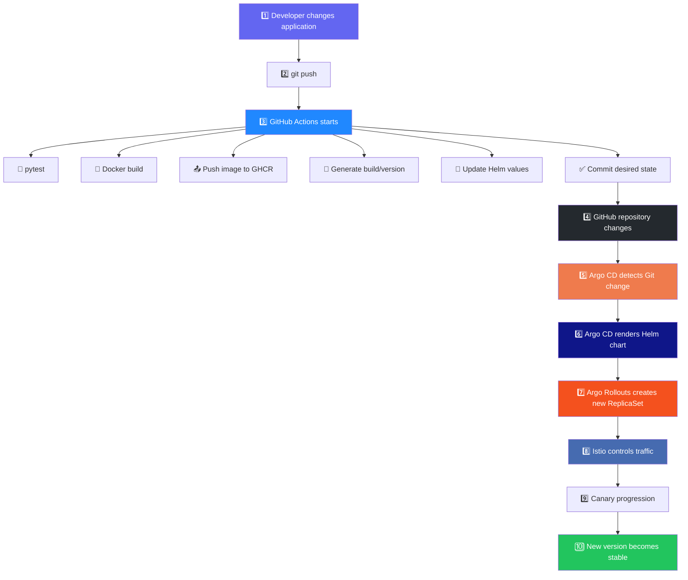

<div align="center">

| Responsibility | Owner |
|---|:---:|
| 🧪 **CI** | GitHub Actions |
| 🔄 **CD** | Argo CD |
| 🚀 **Progressive Delivery** | Argo Rollouts |
| 🔀 **Traffic Management** | Istio |

</div>

<br>

---

<div align="center">

### 🎯 From commit to canary — fully automated, fully observable.


</div>
